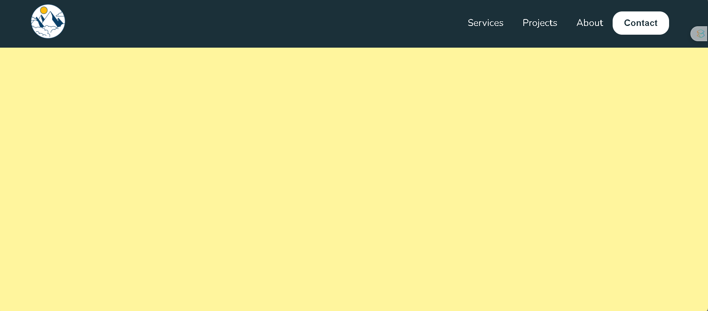
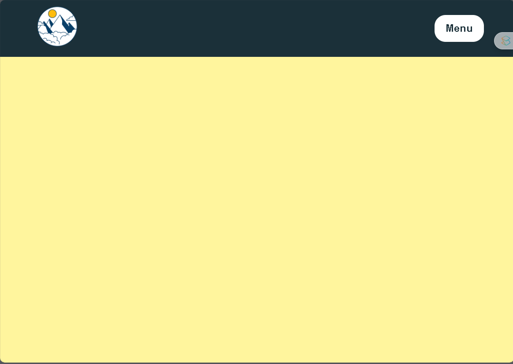

# Navbar Responsivo


- La barra de navegación se adapta a diferentes tamaños de pantalla.
- Botones: Incluye un botón de contacto y un botón de menú que se muestra en dispositivos como tabletas.

## Responsivo


## Default


## Estructura 
1. `index.html`
2. `styles.css`

### index.html
```html
<!DOCTYPE html>
<html lang="en">
<head>
    <meta charset="UTF-8">
    <meta name="viewport" content="width=device-width, initial-scale=1.0">
    <link rel="stylesheet" href="./styles.css">
    <title>Document</title>
</head>
<body>
    <header class="header">
        <a href="#" class="logo"></a>
        <nav class="navigation">
            <ul class="nav-list">
                <li class="nav-item"><a href="#">Services</a></li>
                <li class="nav-item"><a href="#">Projects</a></li>
                <li class="nav-item"><a href="#">About</a></li>
            </ul>
        </nav>
        <div class="buttons">
            <button class="btn btn-contact">Contact</button>
            <button class="btn btn-menu">Menu</button>
        </div>
    </header>
</body>
</html>
```

### styles.css

```css
@import url('https://fonts.googleapis.com/css2?family=Nunito:wght@400;800&display=swap');

*, *::before, *::after {
    box-sizing: border-box;
    margin: 0;
    padding: 0;
}

body {
    font-family: 'Nunito', sans-serif;
    background-color: #fff59d;
    color: #ffbc0e;
    font-weight: 400;
    font-size: 20px;
}

/* Container */
.header {
    display: grid;
    grid-template-columns: 40% 50% 10%;
    align-items: center;
    background-color: #1b3039;
    padding: 0.5rem 4rem;
}

/* Logo column */
.logo {
    justify-content: center;
}

.logo img {
    max-width: 80px;
}

/* Navigation column */
.navigation {
    display: grid;
    justify-content: end;
}

.nav-list {
    display: grid;
    grid-template-columns: repeat(3, auto);
    list-style: none;
    margin: 0;
    padding: 0;
}

.nav-item {
    padding: 14px 20px;
}

.nav-item a {
    text-decoration: none; /* Quitar el subrayado */
    color: white; /* Color blanco */
}

/* Buttons column */
.buttons {
    display: grid;
    grid-template-columns: auto auto;
    gap: 10px;
}

/* Menu button */
.btn-menu {
    display: none;
    background-color: #333;
    color: white;
    padding: 14px 20px;
    border: none;
    cursor: pointer;
}

/* Contact button */
.btn {
    background-color: white;
    color: #1b3039;
    padding: 13px 20px;
    border-radius: 20px;
    border: none;
    cursor: pointer;
    font-weight: 600;
    font-size: 18px;
}

@media (max-width: 991px) {
    .nav-list {
        display: none;
    }
    .btn-contact {
        display: none;
    }
    .btn-menu {
        display: block;
    }

```
